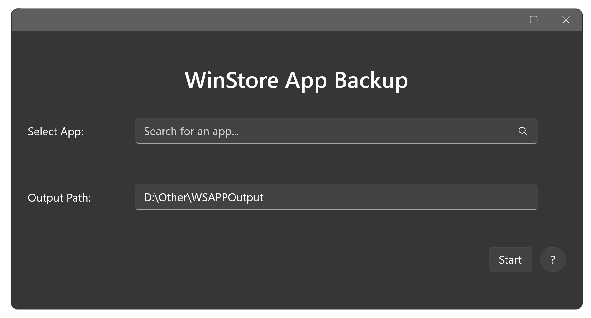

# 📱 WSAppBak: Windows App Cracker

WSAPPBak is a powerful and user-friendly WinUI 3 Windows application designed to Crack paid Windows Application. And Backup Application along with Certificates.

## 🚀 Key Features

- 😈 **Paid Apps**: Install Paid Apps for Free
- 📊 **Backup**: Backup applications alongside Certificates
- 🎨 **Modern UI**: Sleek and intuitive interface built with WinUI 3
- 🔄 **Easy to Use**: Easily Get your app with a single click
- ⚡ **Fast Performance**: Optimized for speed and low resource usage

## 🏁 Getting Started

### Prerequisites

- Windows 10 (Recommended: Windows 11)
- .NET 5.0 Runtime or later
- At least 200MB of free disk space

### Installation

1. Download the latest release from [GitHub Releases](https://github.com/MadCkull/WSAppBak/releases) page.
2. Install Dependencies and package Certificates (See [Closed Issues](https://github.com/MadCkull/WSAppBak/issues?q=is%3Aissue+is%3Aclosed) Section for details)
3. Install Application
4. Done.
### or
1. Clone Repo
2. Open solution in Visual Studio
3. Build & Run.

## 📘 Usage Guide

1. Launch WSAPPBak from your Start menu or desktop shortcut.
2. Select the Application You want to crack from the dropdown menu.(Instructions are provided in Help Window)
3. Choose a destination.
4. Click "Start" and wait for the process to complete.

### To Install Cracked App:

1. Open Output Folder.
2. Install Certificates (Detailed Instruction are given in Help Window)
3. Install Appx File.
4. Enjoy Paid App for Free. 😈

## 🔧 Troubleshooting

Encountering issues? Try these steps:

1. Ensure you're running the latest version of **WSAPPBak** and **Windows 11**.
2. Having issues in installation? Check [Issues](https://github.com/MadCkull/WSAppBak/issues?q=is%3Aissue+is%3Aclosed) Section.
3. If the problem persists, please [open an issue](https://github.com/MadCkull/WSAppBak/issues) on our GitHub page.

## 🤝 Contributing

We welcome contributions! Here's how you can help:

1. Fork the repository
2. Create your feature branch (`git checkout -b feature/AmazingFeature`)
3. Commit your changes (`git commit -m 'Add some AmazingFeature'`)
4. Push to the branch (`git push origin feature/AmazingFeature`)
5. Open a Pull Request

## ⚠️ Disclaimer

  It's crucial to understand that circumventing paid app licensing is illegal and unethical. This repository is intended for educational purposes only. Distributing or using WSAppBak to install paid apps for free violates copyright laws and developer rights.

## 👏 Acknowledgments

- Thanks to [Wapitiii](https://github.com/Wapitiii/WSAppBak.git) (Original Repo)
- Special thanks to the WinUI 3 team for their excellent framework
- Icon assets provided by [Iconify](https://iconify.design/)

## Note:

It's not 100% accurate, don't expect it to work on every app..

---

Made with 😈 intentions by **MadCkull**
